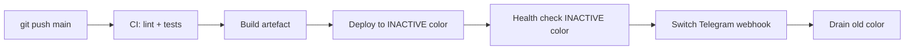

# Blue-green deploys

mycasino runs two complete copies of the stack — **blue** and
**green** — and switches Telegram between them with a single
`setWebhook` call.  Zero requests are dropped during a deploy.

## Layout

```
/opt/mycasino/
  current   -> blue        # symlink — points at the active color
  blue/                    # full checkout + venv
    .venv/
    src/
    .env
  green/                   # the other color
    .venv/
    src/
    .env
```

systemd services point at `/opt/mycasino/current` so flipping the
symlink + reloading services flips the world.

## Pipeline (CI/CD)



## Switch script

`deploy/blue_green_switch.sh` (sketch — adapt to your infrastructure):

```bash
#!/usr/bin/env bash
set -euo pipefail
TARGET="${1:?usage: $0 blue|green}"
OTHER=$( [[ "$TARGET" == "blue" ]] && echo green || echo blue )

# 1. Roll out the new code to the inactive color.
sudo -u mycasino git -C "/opt/mycasino/$TARGET" pull --ff-only
sudo -u mycasino "/opt/mycasino/$TARGET/.venv/bin/pip" install -r \
    "/opt/mycasino/$TARGET/requirements.txt" \
    -r "/opt/mycasino/$TARGET/requirements-runtime.txt"

# 2. Bring the new color's workers up under their own systemd slice.
sudo systemctl start "mycasino-worker@${TARGET}-1.service"
sudo systemctl start "mycasino-worker@${TARGET}-2.service"

# 3. Run pre-flight checks — same /readyz endpoint used by k8s readiness.
for i in 1 2 3 4 5; do
  if curl -fsS "http://localhost:9100/readyz" > /dev/null; then
    break
  fi
  sleep 2
done

# 4. Flip the symlink so future systemd reloads start the new color.
sudo ln -sfn "/opt/mycasino/$TARGET" "/opt/mycasino/current"

# 5. Update Telegram webhook to point at the active receiver.
curl -fsS -X POST "https://api.telegram.org/bot${BOT_TOKEN}/setWebhook" \
    -d "url=${WEBHOOK_URL}" \
    -d "secret_token=${MYCASINO_RECEIVER_SECRET}"

# 6. Drain the old color.  Send SIGTERM and wait for inflight entries
#    to be ack'd; XAUTOCLAIM on the new workers will pick up anything
#    that doesn't drain in time.
sudo systemctl stop "mycasino-worker@${OTHER}-1.service" || true
sudo systemctl stop "mycasino-worker@${OTHER}-2.service" || true

echo "Switched to ${TARGET}.  Old color (${OTHER}) drained."
```

## Roll back

Run the same script with the previous color as the argument.  Since
both colors share the same Postgres + Redis, no data migration is
needed.

## Schema migrations

Migrations must be **backwards-compatible**:

* Always-additive DDL (new tables, new nullable columns, new
  indexes).
* No `DROP COLUMN`, no renames, no NOT-NULL-adding ALTERs in the
  same deploy that needs them.

For breaking changes, use the **two-deploy** dance:

1. Deploy code that reads both shapes.
2. Run the migration.
3. Deploy code that only reads the new shape.

## Verifying zero downtime

Trail the receiver's logs during a deploy:

```bash
journalctl -u mycasino-receiver -f
```

You should see a continuous stream of webhook POSTs with no 5xx
responses.  Then trail the new workers and confirm the same
`update_id` values are being acked.

## Why we don't use Kubernetes

`mycasino` is a single Telegram bot; running it on K8s adds an order
of magnitude more moving parts.  Blue-green on plain systemd hits
zero-downtime in <50 LoC and is trivially observable.  Revisit if you
ever shard the bot across multiple tokens.
